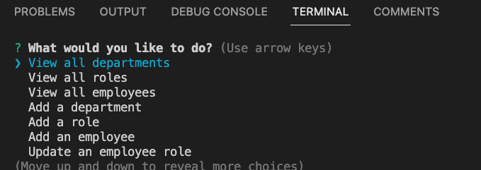
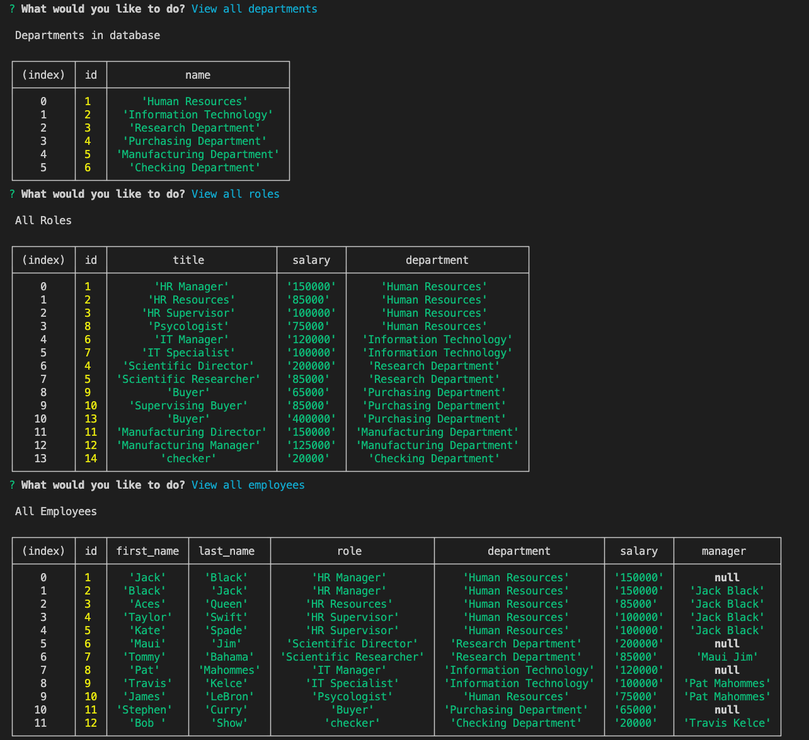

# employee-tracker

## Description
This program is to help organize a company's employee database.  You can add departments, roles, and employees.


## Table of Contents
* [Links](#links)

* [Installation](#installation)

* [Usage](#usage)

* [License](#license)

* [Code](#code)

* [Tests](#tests)

* [Questions](#questions)

## Links

GitHub URL:  https://github.com/rypab4/employee-tracker
Walkthrough Video: https://drive.google.com/file/d/1S7ZzhdFIhk9MOCBPdhmCM2ZQ_Y7Jb9x-/view 

## Installations 

To install necessary dependencies, run the following command:

```
node.js
npm install
    "express": "^4.16.4",
    "mysql2": "^3.1.0",
    "console.table": "^0.10.0",
    "inquirer": "^8.2.5",

```


## Usage
This tool is able to to organize and plan a business through creating a database of department, roles and employees.
1.  Git clone git@github.com:rypab4/employee-tracker.git


2.  You can choose from the menu and enter according to the instructions



3.  Tables will look like this:




## License
    
none


## Code
* HTML/CSS
* JS
* Bootstrap
* Node.js
* Jest
* Inquirer
* fs


## Tests
To run tests, run the follwoing command:
```
npm test
```

## Questions
If you have any questions about the repo, open an issue or contact me directly at rypab4@gmail.com.  You can find my work at https://www.github.com/rypab4.

